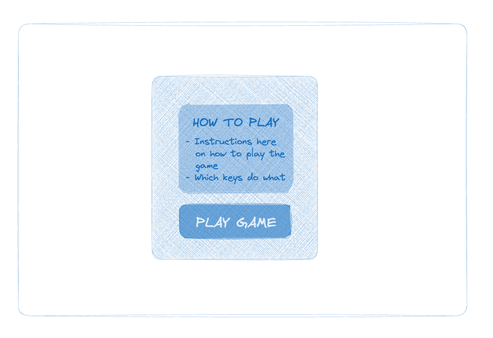
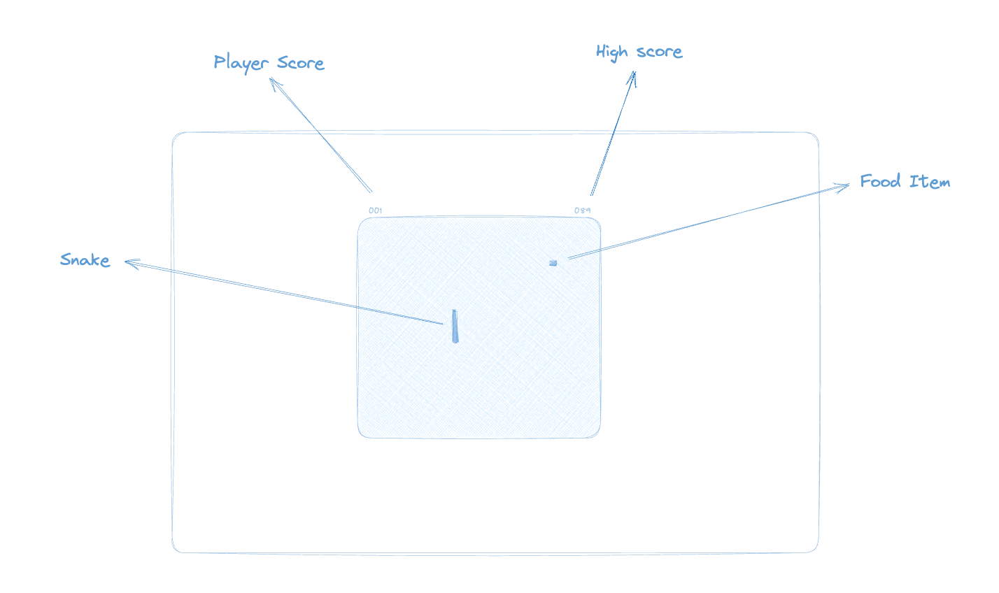
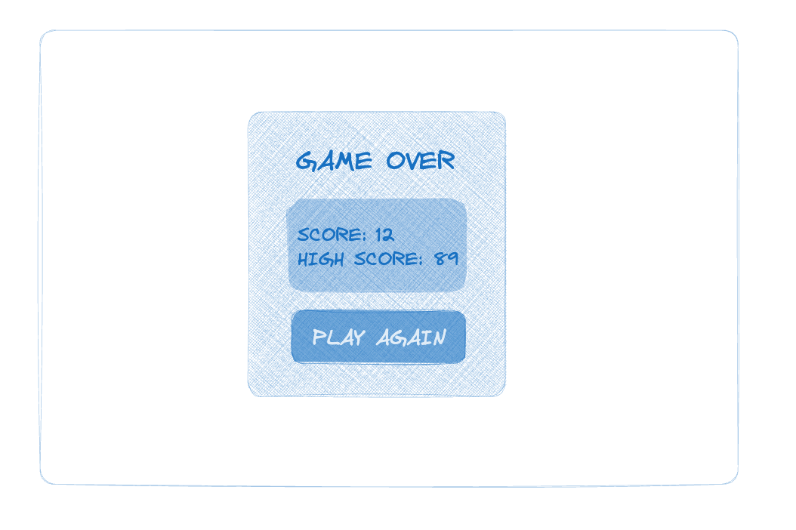
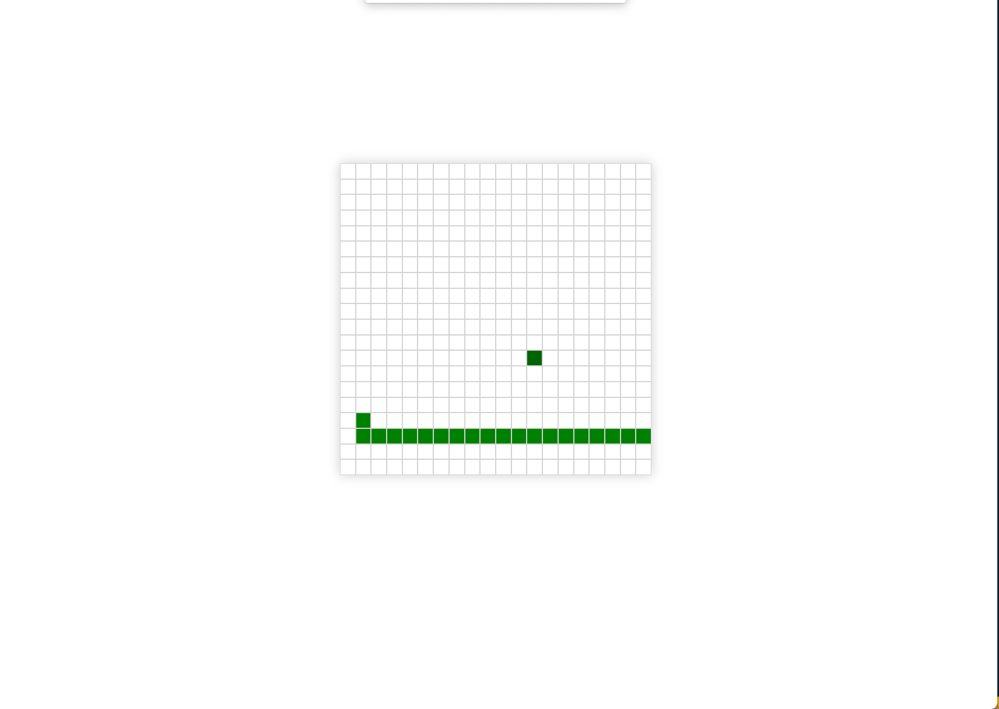
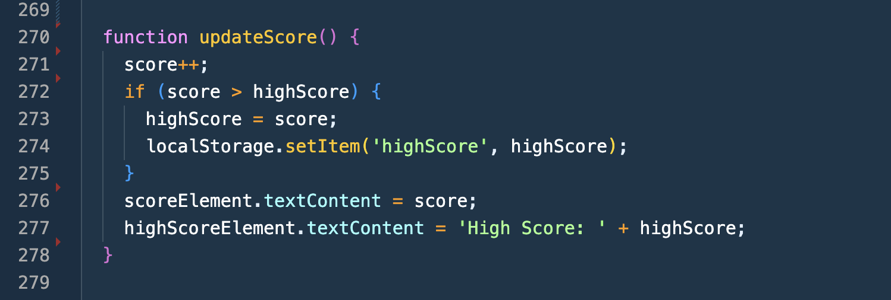
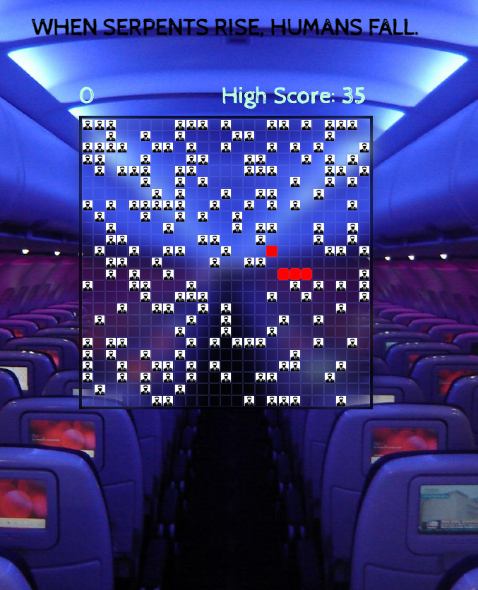
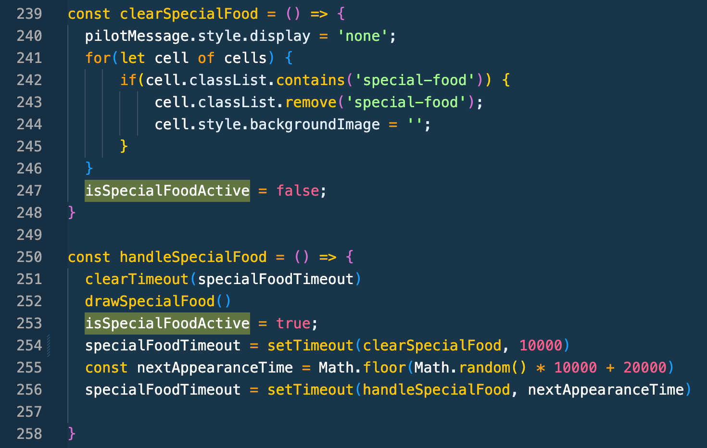
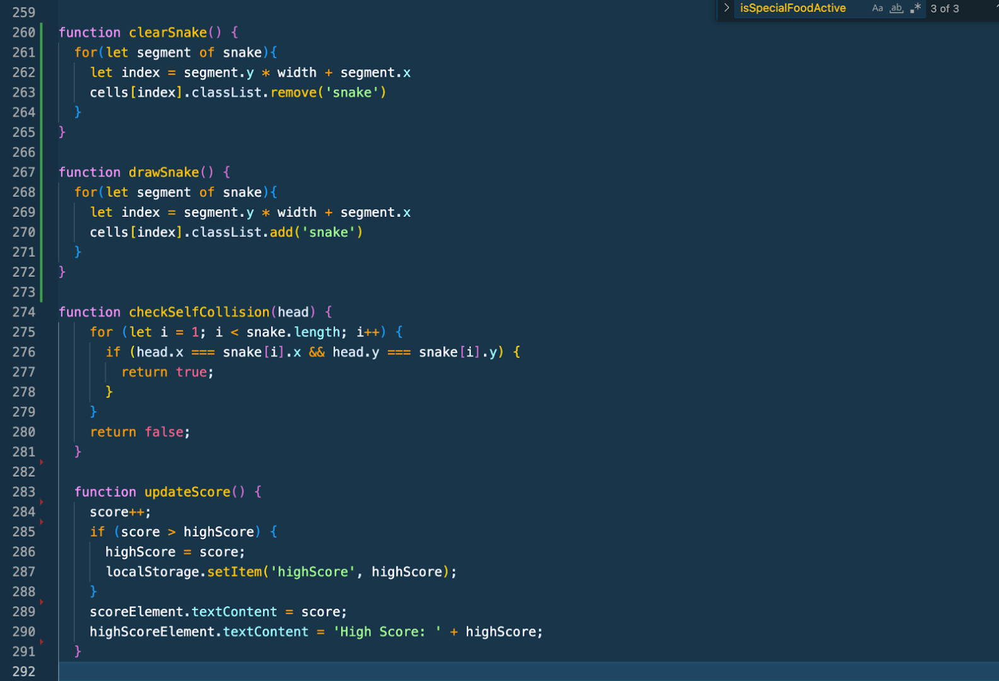

# Snakes on a Plane

## Table of Contents

---

- [Description](#description)
- [Deployment Link](#deployment-link)
- [Code Installation Guide](#code-installation-guide)
- [Timeframe & Working Team](#timeframe--working-team)
- [Technologies Used](#technologies-used)
- [Brief](#brief)
- [Planning](#planning)
- [Build Process](#build-process)
- [Key Learnings & Takeaways](#key-learnings--takeaways)
- [Future Improvements](#future-improvements)
- [How to Play](#how-to-play)

  ## Description

---

This project is a web-based version of the classic game Snake, titled "Snakes on a Plane". It was built using HTML, CSS, and JavaScript. This is the first project I created in week three of my software engineering boot camp, The game was created as a part of my coding journey to learn and understand the fundamentals of these technologies.

## Deployment Link

---

Play the game here and try to set a new high score!

https://louraff.github.io/snake/

**Opening Screen:**


**Game Play Screen:**


**Game Over Screen:**


## Code Installation Guide

---

If you want to dive into the code for this project, follow the steps below:

**Step 1: Visit the Repository**

Go to the repository for this game via the link: https://github.com/louraff/snake

**Step 2: Fork the Repository**
To create a personal copy of the repository on your GitHub account, click the 'Fork' button at the top right corner of the page.

**Step 3: Clone the Repository**
Now, clone the forked repository to your local machine.

Click the green 'Code' button on your forked repository.

Copy the URL that appears.

Open a terminal/command prompt on your local machine.

Navigate to the directory where you want to clone the repository.

Copy this code into your terminal:

```bash
git clone https://github.com/YOUR-USERNAME/snake.git
```

Remember to replace YOUR-USERNAME with your actual GitHub username.

**Step 4: Access the Code**
After cloning, you can navigate to the project directory using your terminal:

```bash
cd snake
```

From here, you can view the code with your preferred text editor or IDE. For example, if you're using VS Code, you can open the entire directory in it by typing:

```bash
code .
```

You're now ready to explore the code!

For more info, check out my other repository in GitHub [here](https://github.com/louraff/gitgettingstarted).

## Timeframe & Working Team

---

This project was assigned in the third week of my coding bootcamp. I completed this snake game as a solo project within a tight 3-day timeframe. From start to finish, including planning, coding, testing, and documentation, everything was wrapped up in just three days. It was a challenging but rewarding sprint to get everything done on time.

## Technologies Used

---

**HTML:** Used for structuring the web pages and creating the user interface.
**JavaScript (JS):** The game logic and user interactions were powered by JS. It's like the brain behind the game!
**CSS:** Applied styling to make the snake game visually appealing.
**DevOps:** Took advantage of some nifty development tools and practices to make my life easier during development.
**Visual Studio Code:** My trusty coding buddy! I did all the coding and debugging here.

## Brief

---

**Game Requirements**

- The snake should be able to eat food to grow bigger
- The game should end when the snake hits the wall or itself
- Snake speeds up as it eats more

**Technical Requirements:**

- Render a game in the browser
- Build it on a grid: not using HTML Canvas
- Design logic for winning & visually display which player won
- Include separate HTML / CSS / JavaScript files
- Use Javascript for DOM manipulation

  ## Planning

---

Plan to Build a Snake Game

1. Setting up the Project

- Initialise project directory with index.html, main.js, and styles.css files.
- Set up basic HTML structure in index.html.
- Link main.js and styles.css files to index.html.

2. Creating the Game Board

- Define a grid with 20x20 squares, using a two-dimensional array.
- Style the game board as a grid using CSS.

3. Implementing the Snake

- Represent the snake as an array of coordinates on the grid.
- Start the snake in the middle of the board.
- Draw the snake on the game board.

4. Moving the Snake

- Create a game loop that moves the snake in its current direction.
- Change the direction when the player presses an arrow key.
- Don’t let the snake go immediately back on itself

5. Adding the Food

- Place food randomly on the board in an unoccupied cell.
- Draw the food on the board.

6. Growing the Snake

- Check if the next cell in the snake's direction contains food.
- If yes, remove the food, increase the score, and add a new segment to the snake.
- If not, move the snake.

7. Game Over Conditions

- Check if the snake hits the wall or itself.
- End the game, stop the game loop, and display a game-over message.

8. Speeding up the Snake

- Set a base speed for the snake.
- Decrease the delay in the game loop each time the snake eats food.

**Frontend Wireframes**

I initially planned three screens for this game:

1. A starting screen with instructions and a large ‘Play Game’ button.



2. The second screen would be the game-play screen. It would display the grid with the snake immediately moving and a food item on the grid. The current player score and high score would also be displayed



3. The third screen is the game over screen which displays the score, the high score and a large ‘Play Again’ button.



## Build Process

---

**The Basic Game**
The first version was a basic grid-based game with the snake moving in four directions. However, the game had no score tracking or high-score system.



**Adding Score and High Score**
The next step was to incorporate a scoring system. The score would increment with each food the snake consumed. Along with that, a high-score system was implemented using localStorage, which tracked the highest score achieved on the user's browser.



**Special Food and Time Limit**
To make the game more exciting, I added a special food item. In line with the ‘Snakes on a Plane’ theme, that special food item is a pilot. I wanted the food to appear at random intervals and disappear after a short time and offer extra points when eaten in time. Implementing this feature wasn't straightforward, figuring out the random appearances and timeouts caused a few synchronisation issues, to say the least.

Picture this - you're playing a game, and out of nowhere, multiple instances of an artefact appear on the screen. Two words: spooky, intimidating (I mean… snake is seriously outnumbered here).



With my nifty isSpecialFoodActive variable and a few tweaks to my handleSpecialFood function, I managed to get those pesky pilots under control.



**Tuning and Polishing**
Next, it was time to polish the game by adding audio effects for different actions like a flight takeoff sound when starting the game, hissing on game over, background music, and two different sounds for when the snake eats food or a pilot.

**Improving UX/UI**
The UI was then enhanced with the addition of game start and game over screens, showing helpful information to the user, such as their score, the high score, and a world record score

## Key Learnings & Takeaways

---

Building this game felt like trying to win a three-legged race while simultaneously learning how to juggle. That's what striking a balance between building a project and learning feels like! However, creating the Snake game was an incredibly rewarding process which allowed me to delve deep into JavaScript while also managing a fast-paced project solo. I took away a lot of learnings, to say the least, and here are a few:

**Mastering Simplicity Before Complexity:**
It turns out that diving headfirst into the deep end of complexity can leave you gasping for air (and help). This approach reinforced the importance of doing simple tasks well before tackling more complex ones.

**Balancing Building and Learning:**
I found it hard to strike a balance between building a product and learning during the process. There were instances where I needed to refresh my knowledge on certain aspects before. This highlighted the importance of a reflective process in learning - recognising when a concept is unclear and taking the initiative to revisit lessons to reinforce understanding.

**Detailed Planning and Iterative Refactoring:**
Did I rush? You bet. Was I figuring it out as I went along? Guilty as charged. But wow, did I learn the value of a detailed plan and the art of iterative refactoring. It's like having a GPS when you're lost in the middle of nowhere. Sure, you may still make a wrong turn or two, but at least you won't end up in a different county. I learned the importance of having a detailed plan and continuously revisiting and refining it, especially the necessity of keeping your cognitive load to a minimum.

**Time Management:**
I felt rushed through this project, which taught me the importance of time management. I now have a better understanding of how to prioritise tasks, how to unblock myself and the importance of breaks. A big takeaway is that planning effectively and comprehensively is time well spent.

**Translating 2D Coordinates to 1D Array:**
This was a key technical takeaway, as this conversion is fundamental for creating a grid-based game like Snake. Who knew that switching between two-dimensional coordinates and a one-dimensional array would be as exciting as hopping between alternate realities? This learning will be handy for future projects where such a conversion might be necessary.

**Developing Engaging Themes and Simplifying UX:**
I decided to inject some extra fun into the game with the ‘Snakes on a Plane’ theme. The aim was to make the game more appealing and to differentiate it from the traditional Snake game. I am really happy with the decision to simplify the start screen (see original wireframe) for a streamlined user experience. The instructions were clunky and instead, I relied on intuitiveness and popularity. Instead, users can jump straight into the game!


**Effective Problem Solving Techniques**
Finally, this project has enhanced my problem-solving skills. By the end I was splitting larger tasks into smaller tickets and breaking abstract problems into a series of smaller, manageable issues, which allowed me to work systematically and efficiently. This approach transformed the daunting process of game development into a series of solvable puzzles, providing a clear path forward when faced with obstacles. This can be seen in all the small functions that come together to bring the game to life. Here are just a few:



Building this Snake game has undoubtedly been a remarkable journey of learning and growth. From reinforcing fundamental JavaScript concepts to mastering crucial software engineering practices, each learning has made me a more skilled and confident software engineer. I'm excited to apply these learnings to future projects and continue this journey of learning and development.

## Future Improvements

---

There are a few enhancements I would love to implement in the future!

Here are a few:

- Add a countdown to the start of the game.

- Adding a 'special food item' that crops up sporadically, it will have a time limit for how long it appears and the user will score extra points if they manage to eat it in time. For the purpose of the theme, the 'special food item' would be a pilot.

- Add difficulty levels: one level might include random cells that the snake must avoid for a period of time, adding walls inside the grid which must not be collided with, etc.

- Add an easier level where the snake can pass through the grid borders and come out at the opposite end of the grid.

- Add multiplayer functionality so you can play with your friends!

  ## How to Play:

---

How to Play:

1. Press any key to start the game!

2. The snake moves automatically and continually in the direction it is facing. You can control the direction of the snake using the arrow keys.

   - Press the Up Arrow key to move the snake up.
   - Press the Down Arrow key to move the snake down.
   - Press the Left Arrow key to move the snake left.
   - Press the Right Arrow key to move the snake right.

3. The objective of the game is to eat as much food as possible. Each time the snake eats the food (red dot), the score increases, and the snake grows in size.

4. The game ends if the snake hits the border of the game area or if the snake collides with itself.

5. Your current score and the high score are displayed on the screen. The high score is saved in the local storage of your web browser, so it persists across different game sessions.

6. If the game ends, a "Game Over" screen will appear showing your score, the high score, and the world record. You can click on the "Try Again" button to restart the game.
