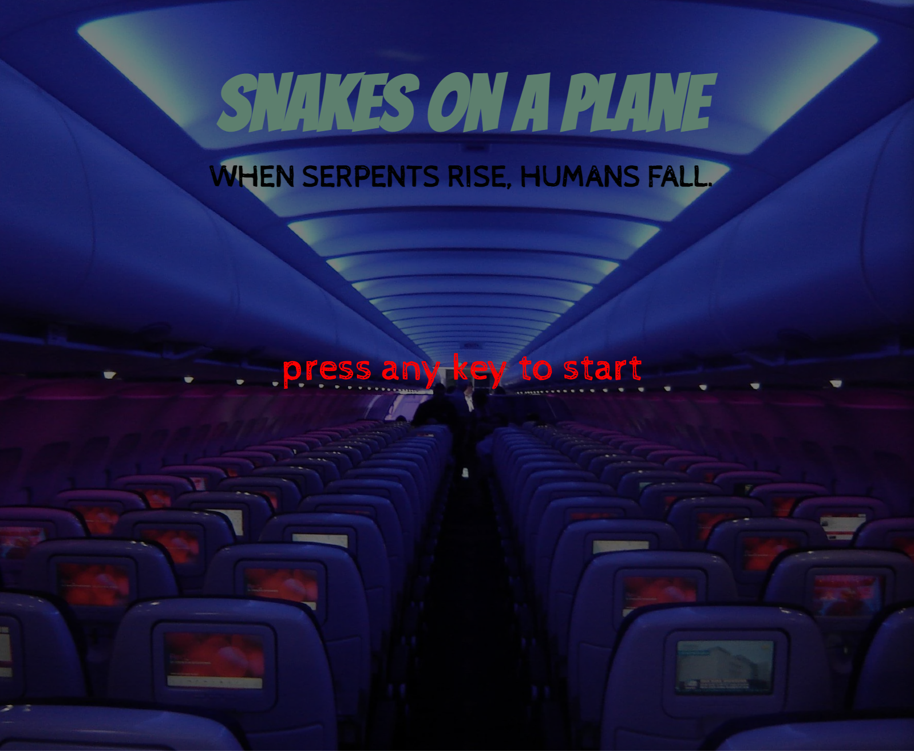

# Snakes on a Plane

This project is a web-based version of the classic game Snake, titled "Snakes on a Plane". It was built using HTML, CSS, and JavaScript. This is the first project I created in week three of my software engineering boot camp. The game was created as a part of my coding journey to learn and understand the fundamentals of these technologies.

## Opening Screen



## Game Play Screen


## Game Over Screen


## Technologies Used

- HTML5
- CSS3
- JavaScript
- LocalStorage for score keeping

## Getting Started

To install and run this game, follow these steps:

1. Clone this repository to your local machine using the following command in your terminal:

```bash
git clone https://github.com/louraff/snake
```

2. Open the snake project folder by running the following command in your terminal:

```bash
cd snake
```

3. Open up the code using the following command:

```bash
code .
```

For more info, check out my other repository in GitHub [here](https://github.com/louraff/gitgettingstarted).

## How to Play:

How to Play:

1. Press any key to start the game!

2. The snake moves automatically and continually in the direction it is facing. You can control the direction of the snake using the arrow keys.
   - Press the Up Arrow key to move the snake up.
   - Press the Down Arrow key to move the snake down.
   - Press the Left Arrow key to move the snake left.
   - Press the Right Arrow key to move the snake right.
3. The objective of the game is to eat as much food as possible. Each time the snake eats the food (red dot), the score increases, and the snake grows in size.
4. The game ends if the snake hits the border of the game area or if the snake collides with itself.
5. Your current score and the high score are displayed on the screen. The high score is saved in the local storage of your web browser, so it persists across different game sessions.
6. If the game ends, a "Game Over" screen will appear showing your score, the high score, and the world record. You can click on the "Try Again" button to restart the game.

## Next Steps:

There are so many enhancements I have planned for the future!

Here are a few:

- Add a countdown to the start of the game.

- Adding a 'special food item' that crops up sporadically, it will have a time limit for how long it appears and the user will score extra points if they manage to eat it in time. For the purpose of the theme, the 'special food item' would be a pilot.

- Add difficulty levels such as including random cells that the snake must avoid for a period of time, adding walls inside the grid which must not be collided with.

- Add an easier level where the snake can pass through the grid borders and come out at the opposite end of the grid.

- Add multi player functionality so you can play with your friends!
